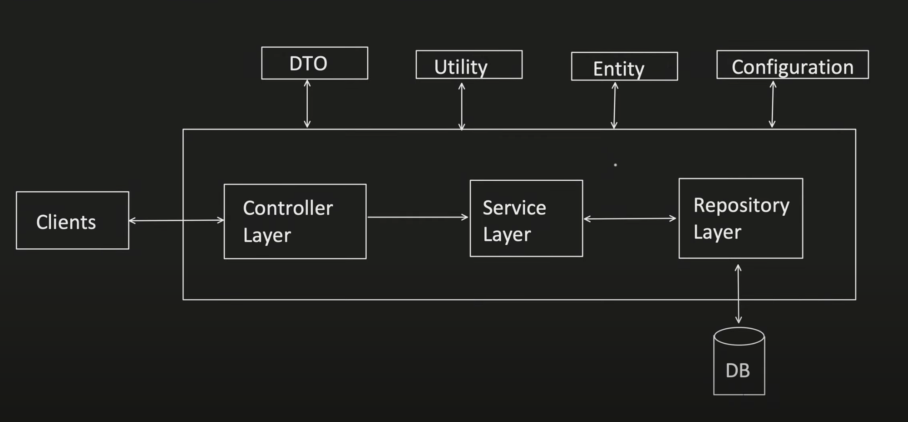

### DTO(Data Transfer Object)
- Request DTO
    - map the data coming from the client to request dto
    - controller layer takes the responsibility to do the mapping
- Response DTO
    - map the data coming from the db/repository to request dto
    - service layer takes the responsibility to do the mapping

### Utitlity
Anything common across any layers

### Entity
- Entity are classes that are direct representation of our tables
- Used by repository mostly

### Configuration
- application.properties to define fixed values

### Controller Layer
- contains all the apis that client interacts with

### Service Layer
- contains business logic which interacts with Repository Layer to giver response back to Controller Layer

### Repository Layer
- Interacts with DB and gives response back to Service Layer